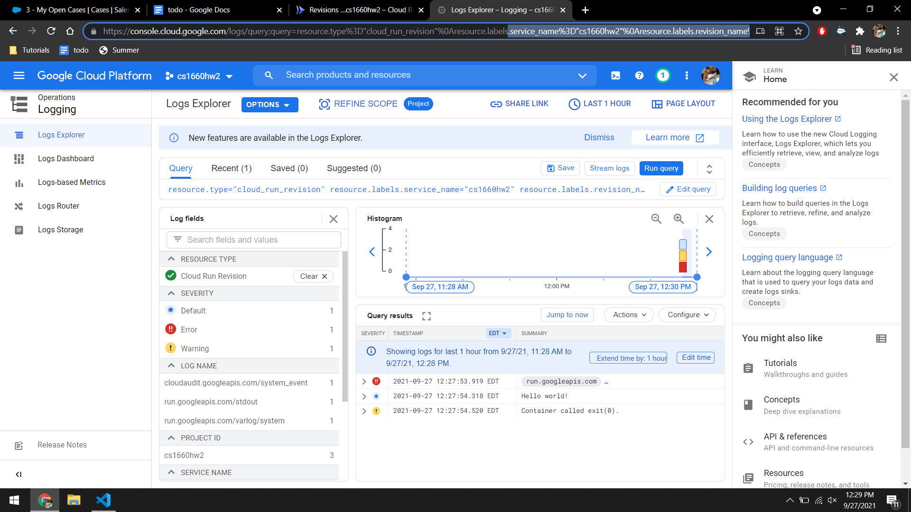
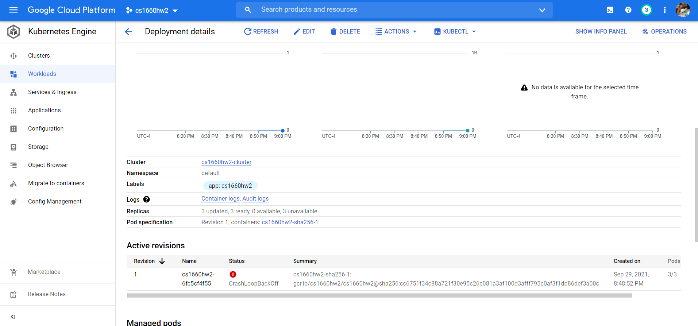
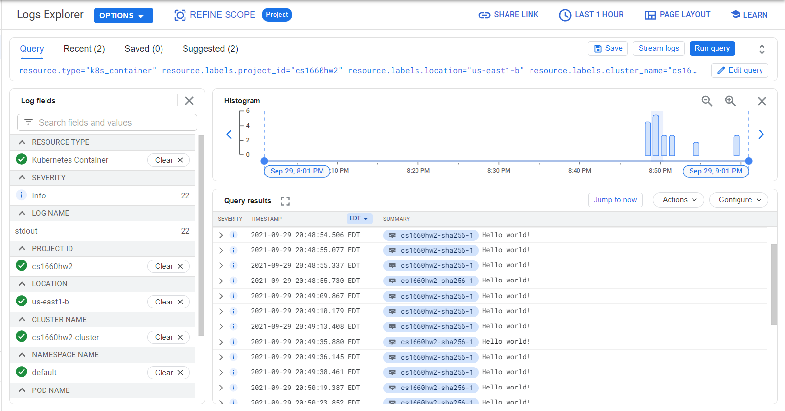
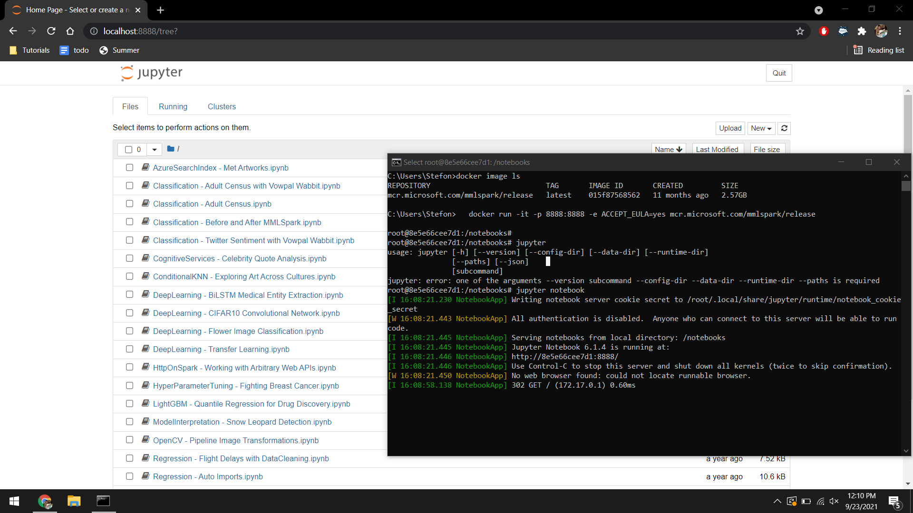

# CS1660 Homework 2
All images and additional files can be found in the Docker folder

## Container 1

1. Link to container on docker hub: [https://hub.docker.com/r/smm248/cs1660hw2](https://hub.docker.com/r/smm248/cs1660hw2)
2. Screenshot of docker container running on GCP: 

3. Docker and python files can be found in the Docker folder

## Container 1 Bonus

1. Screenshot of Kubernetes cluster deployed on GCP:

2. Screenshot of output of Kubernetes cluster on GCP:

## Container 2

1. Screenshot of Jupyter notebook running on localhost:

